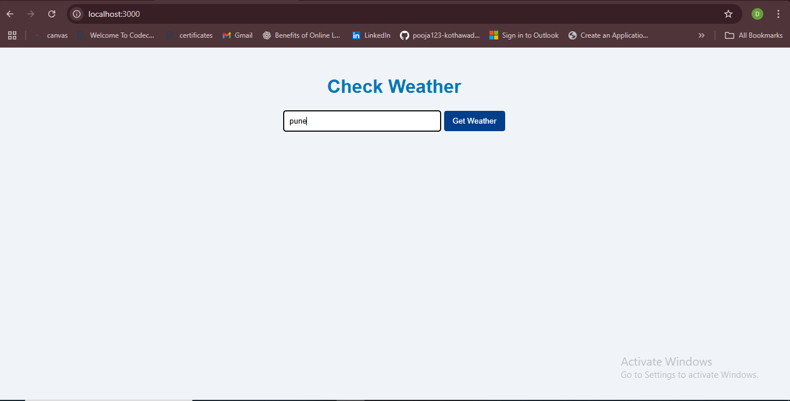
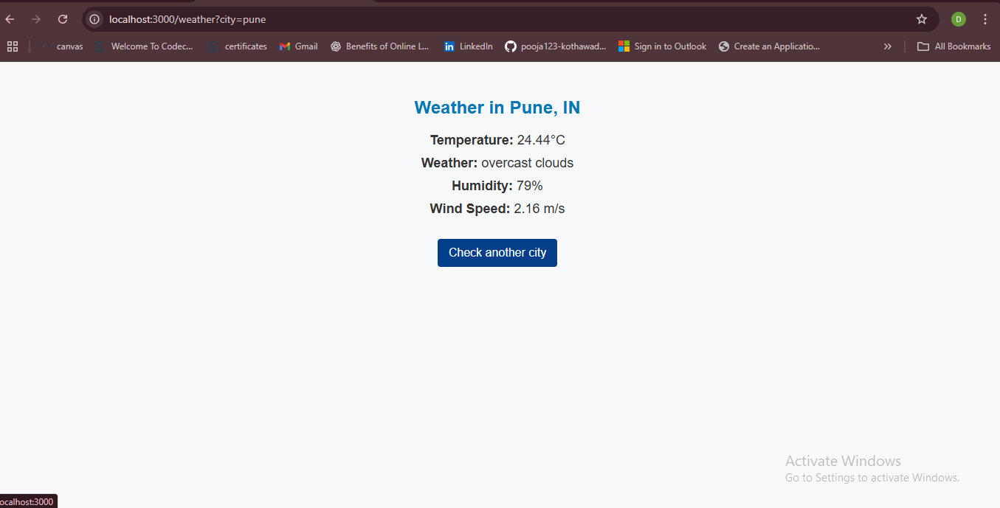

````markdown
# 🌦️ Simple Weather App (Node.js + Express)

This is a basic Weather App built using **Node.js**, **Express**, **Axios**, and **MongoDB**.  
It allows users to check current weather information for any city using the **OpenWeatherMap API**, and also view the last 10 search results stored in MongoDB.


---
````

## 📸 Preview

 

 

 


---

## 🔧 Features

- Enter city name using a simple form.
- Fetches and displays:
  - Temperature
  - Weather condition (e.g. sunny, cloudy)
  - Humidity
  - Wind speed
- Stores search history in MongoDB.
- View last 10 searches in a simple HTML table via `/history-page`.
- Error handling for invalid city names.
- Clean and basic CSS styling.
- Frontend served using Express.
---

## 🛠️ Tech Stack

- Node.js
- Express.js
- Axios
- MongoDB + Mongoose
- HTML + CSS 
- OpenWeatherMap API
  
---

## 🚀 How to Run Locally

### 1. Clone the repository

```bash
git clone https://github.com/pooja123-kothawade/Project-Node.js.git
cd Project-Node.js
````

### 2. Install dependencies

```bash
npm install
```

### 3. Set up your `.env` file

Create a `.env` file in the root folder:

```env
API_KEY=your_openweathermap_api_key_here
MONGODB_URI=your_mongodb_connection_string_here
```

> You can get a free API key by signing up at [OpenWeatherMap](https://openweathermap.org/api)  
> For MongoDB, you can either [install locally](https://www.mongodb.com/try/download/community) or use [MongoDB Atlas](https://www.mongodb.com/cloud/atlas).

### 4. Run the app

```bash
node app.js
```

Visit:  
- `http://localhost:3000` → Search weather  
- `http://localhost:3000/history-page` → View last 10 searches

---

---

## 📁 Project Structure

```
Project-Node.js/
├── public/
│   ├── index.html
│   └── style.css
├── .env
├── .gitignore
├── app.js
├── package.json
└── README.md
```

---

## 🌐 Live Demo

**Coming soon** (optional – deploy on [Render](https://render.com/), [Railway](https://railway.app/), [Vercel](https://vercel.com/))

---

## 👩‍💻 Author

**Pooja Kothawade**
[GitHub](https://github.com/pooja123-kothawade)

---

## 📜 License

This project is owned by Pooja Mahendra Kothawade

```


